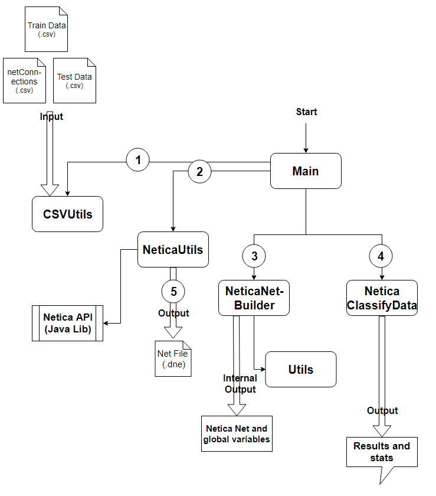

# Code documentation
A lot of in-code documentation exits and should make the code understandable. Here are some "justifications" why we did stuff the way we did it (most of the time the reason is Netica).
Additionally a short overview about all functions will be presented. 

* All code is stored in the "src/app/Main.java" file. 


## Justifications 
As python native developers some of the code structure we had to use because of Java and Netica where not "normal". Therefore we justify them in the following key points.

* To make our Netica code run we had to build a one-file app. Thus all classes had to be put into one file. This creates a very unclean class patrice but was our only working option for Netica.
* A lot of our code is surrounded by try-cath statements. This has to be done because every peace of Netica codes throws exceptions.
* When creating a Node, you have to assign it to a new Node object even so just the calling the constructor would do just fine because it adds it to the network. 
* For the possibilities of nodes (e.g. Node states) the set of all value has to be either string or integers. We wanted strings and thus mapped all integer values to ranges that are string objects. 
To have common structure: If possibility is a number -> N indicates pure Number, R indicates Range. 
This was done to because we wanted to utilize strings as inputs and not keep track of conversion tables to numbers. This makes the network more readable for netviewers and our own classification! 
    * Similar we had to change input values because Netica does not use a list object or something like that but a raw string with separators like "." or ",". Thus these chars had to be replaced as well. 
    * For some reason "-" is an invalid char. Thus it was replaced by "bis"
    * Ranges are excluding upper limit and including lower limit
* System.out.println is used instead of logger on purpose.  


## Class Overview
```
- Main: The static entry point and main execution part of the code
- NeticaNetBuilder: A class which builds the a Netica Net for given input data (nodes, links, CPTs)
- CSVUtils: CSV Reader/Parser Class 
- Utils: Contains serveral non-class-specific utility functions (which could be reused somewhere else)
- NeticaUtils: Utils code for Netica (like Net "constructor" and "deconstructor")
- NeticaClassifyData: Class to classifiy given input data for a given netica net
```


