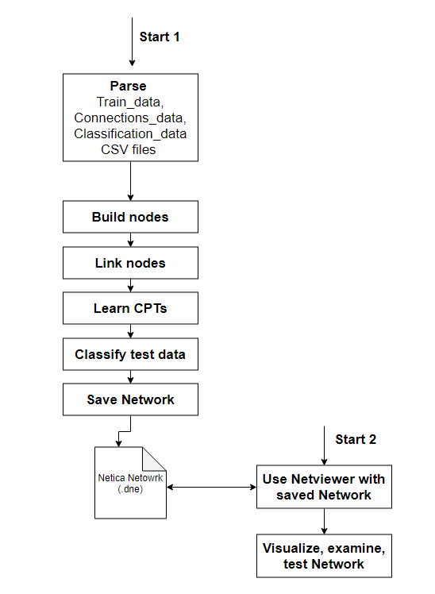

# Introduction
We have used the Framework Netica (Java API Version) from Norsys to build a bayesian network that classifies a case (accumulation of input variables) to a tariff A or B. 

We have chosen Netica because it is the best tool to visualize and reuse created networks even so the library structure, documentation and code feels like an artifact. 
Java was chosen since it is the best version of the Netica API that fits our own skill set. Organically, other Python Libraries were looked at but later discarded due to their lack of required features (like visualization). 

The goal has been to build tool that is as dynamic as possible by having all network properties defined by input files or automatically adjusted by the tool itself. 

## Netica Docu
* Netica Homepage: https://www.norsys.com
* Netica Java Manual: https://www.norsys.com/netica-j/docs/NeticaJ_Man.pdf
* Notice: The free Version of Netica only supports networks with 15 nodes.  

## Documentation Content
The documentation for this projects consists of 4 different files (including this one) which describe everything notable about this project. 
* This document will go into the idea and goal of the project (Intro)
* The Code documentation (code_docu) does note additional information about the code and explain the basics. 
* The Data documentation (data_docu) does contain information about the input data CSV files (Assumptions, content, etc).
* Getting started will describe the normal workflow to run this Application on Windows and how to use the Netviewer. 

## Other Content
* The "imgs" folder holds a set of images which display older and the newest version of link setup for our network.
* The "src" folder holds the app and code we have created.
* The NeticaJ_Win folder holds the Netica Java library
* The "data" folder contains any input data
* The "results" folder contains all output files (also temporary files)

## General project structure and deliverables  
The following is a list of deliverables. 

1. The program extracts all possible nodes + values (possibilities) from a CSV Input file 
2. The program builds nodes with the data from the CSV file 
    * The possibilities will be normalized (to String) and sets of numbers will be transformed into ranges (Strings). This is done to fit to Neticas input options. 
3. The program will link all nodes accordingly to a CSV file that describes the desired links
4. The program wil learn CPTs from the original input data
    * CSV file data will be mapped normalized possibilities and put into a Netica CaseFile (also saved to the output folder)
5. The program will classify input test data given by a csv file and displays results of the classification.  
6. The Network will be saved into a .dne file

7. The network can be displayed, tested and examined within a Netviewer (based on Netica Netviewer Example class) 
    * This can be done after the network has been saved by starting the Netviewer 
    * This could also be done by using the normal Netica app 

### Visualization 



### Further Netica notes 
* We decided against using synthetic nodes because we could only use one additional if we would have used them (due toe cap of 15 nodes) which would have not been enough for our ideal setup. Additionally the CPT learning for synthetic nodes did not work correctly.
* Our CPT learning algorithm is called "counting learning" (see Netica_J manual). We used this implementation because it did was the best fit for our code structure. 
* The example data is heavily biased (+50%) towards the result "B". This made the CPT learning creating CPT tables which are also statistically "biased" towards "B". This resulted in better classification for "B" and worse for "A" in most cases. We did look into editing, creating or modifying our trainings data against this bias but stopped after we decided that this is not in the scope. Similar idea existed for test data and the creation/usage of test/trainings data (K-folds, etc.) but seemed out of scope again.
* We decided to create discrete variables from possible (positive) continuous once by deducing ranges from all given cases with the help of boxplots. This is now done automatically be the program. Hereby any "n.a." value will be mapped to the lowest range and zero is the lowest possible value even if the boxplot would have been lower. 
 


### Learning/Training
We tested different Network connections with different test/training data. Our current Test Data (data/versicherung_a_classify.csv) will create the following final output:
    ````
    3 cases did not have a controll result.
    15 of 17 cases are correct! Ratio: 88.2353 %
    For cases with result B: 11 of 11 cases are correct! Ratio: 100.0 %
    For cases with result A: 4 of 6 cases are correct! Ratio: 66.66667 %
    64.70589 % of all cases are with the result B
    35.294117 % of all cases are with the result A
    ````
    This shows the stats for all results of all classification but every single classification will also be shown with its input and percentages. 
    This test data also contains empty (falsified) data from the original data set to test different input possibilities. 
* In this fashion, several connection setups were created and tested that created certain results when training and testing with all given data. Three of these connection setups can be found under data/connectionSetup. Here the ending has to be read like follows: "O" indicates the overall correct ratio, "B" the ratio for correctness of B and "A" for the correctness of A. The connection setup with the highest values in our tests was the connection setup that we explain in the documentation and created logical before we modified one link after testing. This has been used as the standard for now (just "netConnections.csv")
* The interconnection and relations of nodes and different test data can be examined pretty good in the Netviewer where you can do inference by hand. 

